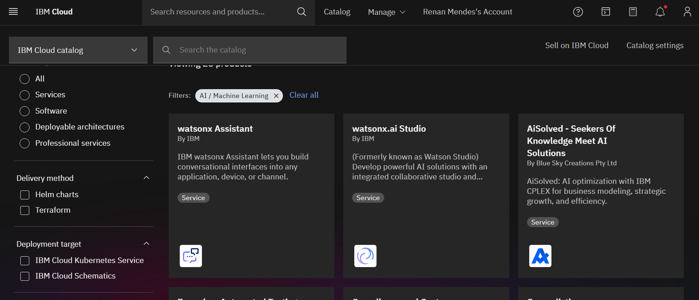

# Chatbot_IBM

## Autor
Renan de Oliveira Mendes

## Sumário

[1. Projeto](#c1)

[2. Classic Experience](#c2)

[3. New Experience / WatsonX Assistant](#c3)

[4. Solução Desenvolvida](#c4)

 

# 1. Projeto

O propósito desse projeto é desenvolver um ou mais chatbots, utilizando a ferramenta e plataforma IBM Watson.
Para fins de aprendizado e estudo.

Vou colocar abaixo o link para teste do Chatbot criado, porém devido ao prazo de teste da ferramenta IBM Watson não esteja mais disponível.
Link: https://web-chat.global.assistant.watson.appdomain.cloud/preview.html?region=au-syd&integrationID=fc4f0cbb-99ab-4603-9f05-1db0bd1bc792&serviceInstanceID=ea66ceb9-5949-4c3b-9e5f-5dee6a17a779

# 2. Classic Experience

Utilizando o fluxo, e o processo clássico, criei o Chatbot Nan para testes, simulando fluxos de conversas, identificando intenções, entidades e salvando valores em váriaveis.

  

  

  

  

  

  

  

## 3 New Experience / WatsonX Assistant

Utilizando as novas funcionalidades criei outro Chatbot Nan para testes.

  

Utilizei os recursos da IBM para criar APIs, Projetos e um modelo de IA generativa, permitindo que meu chatbot pudesse gerar respostas generativas de sugestões.

  

  

  

  

  

